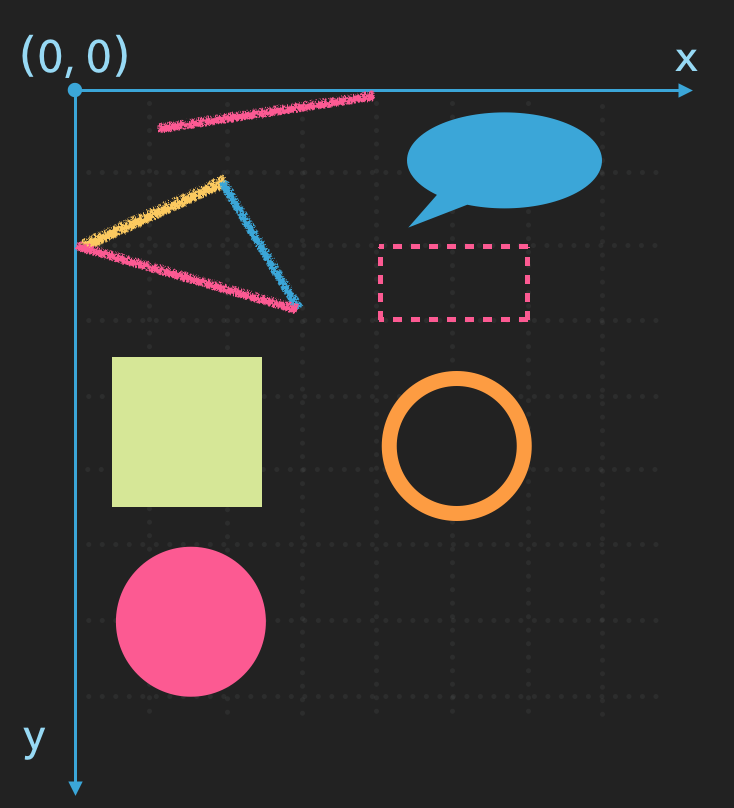
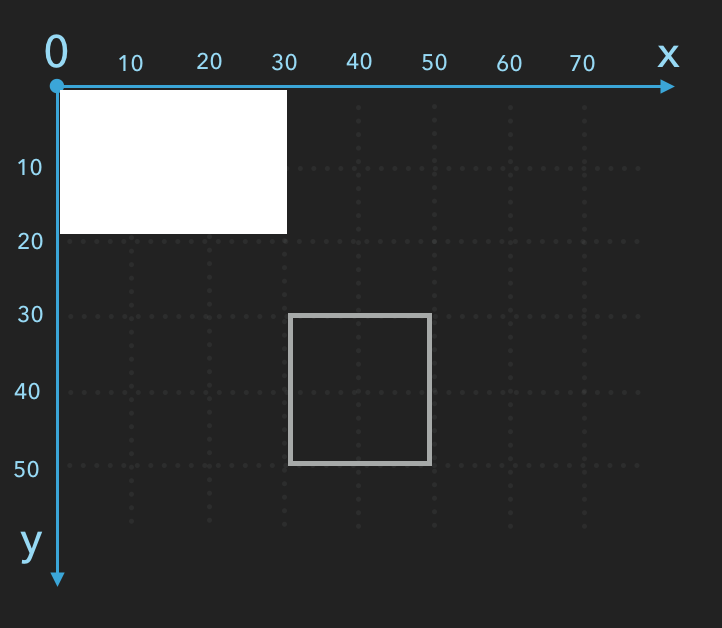
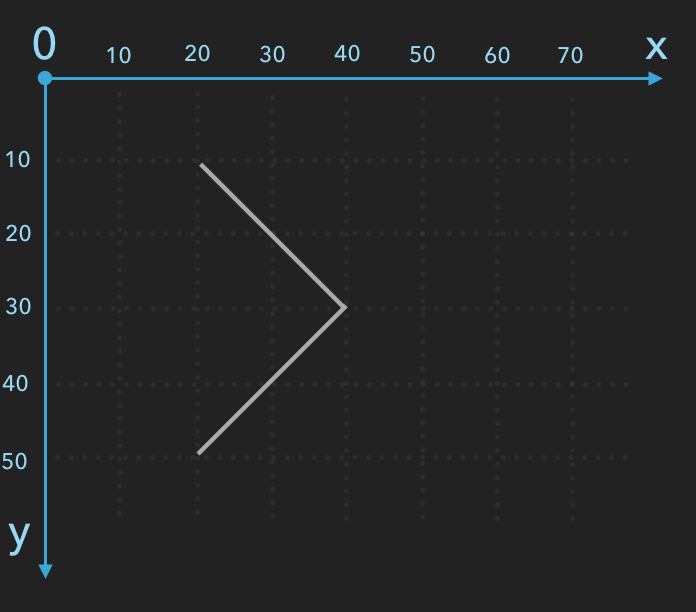
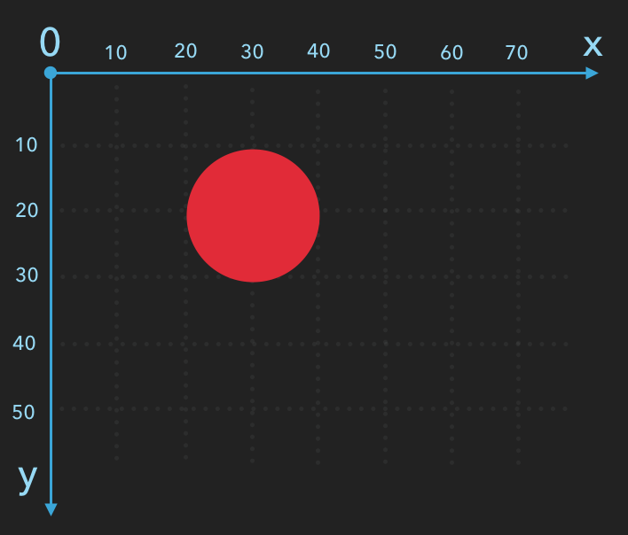
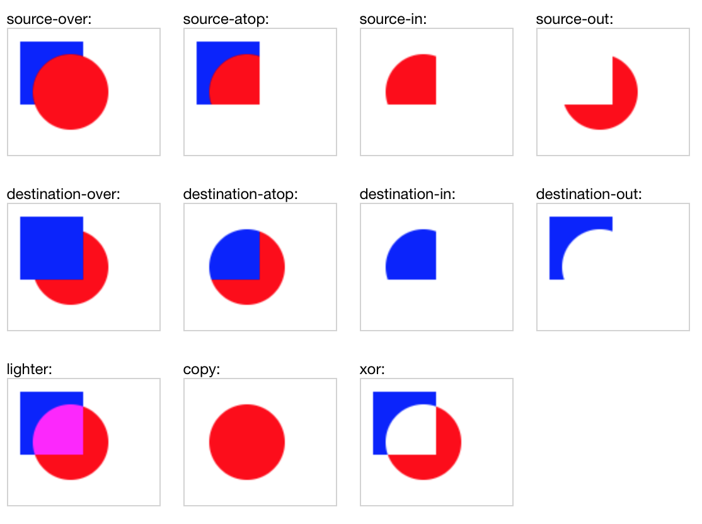
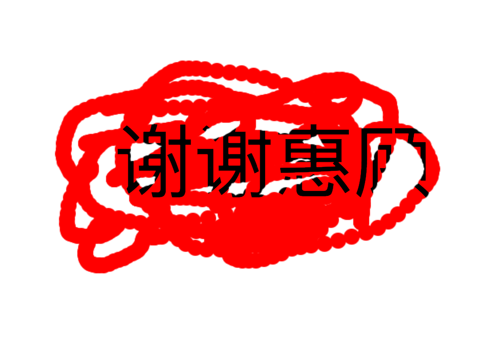
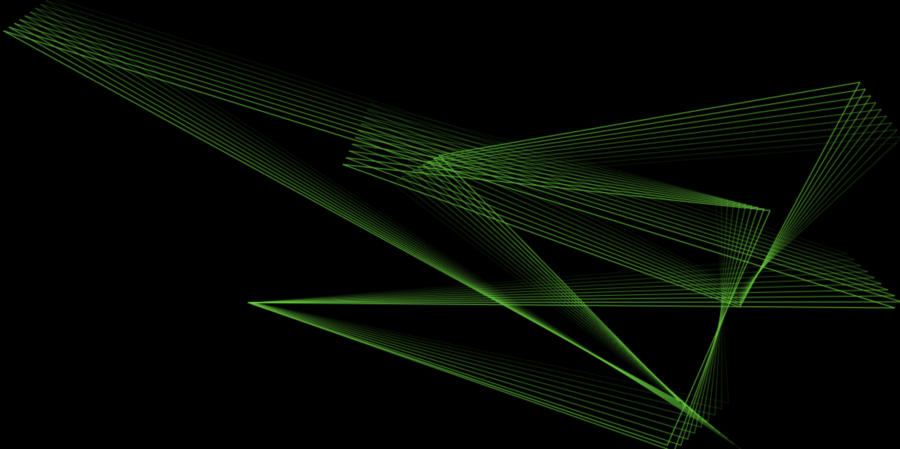
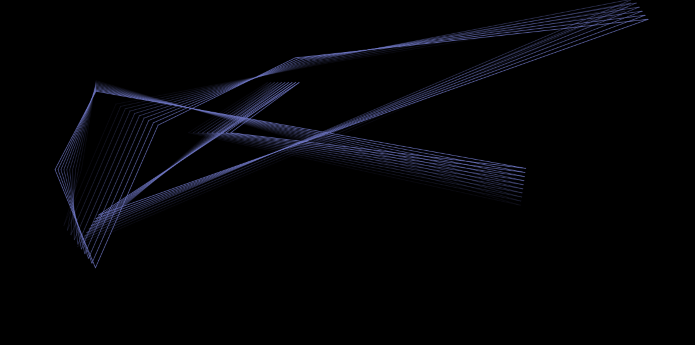
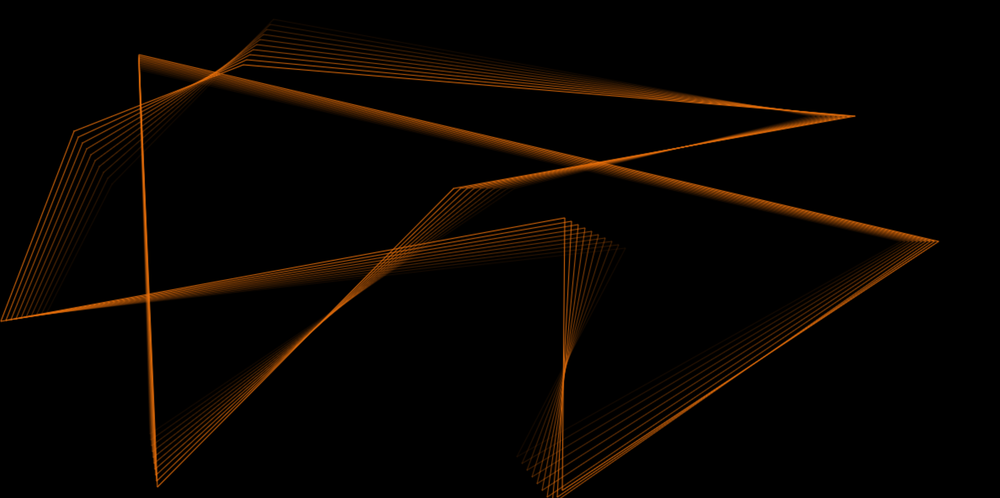

#canvas
* `<canvas>` 本身并没有绘制能力（它仅仅是图形的容器），是一块无色透明的区域，就像一个可以设置宽度高度没有背景的DIV一样，你必须使用JavaScript脚本来完成在其中的绘图任务。
* getContext() 方法可返回一个对象，该对象提供了用于在画布上绘图的方法和属性。可以绘制路径、字符、添加图像、绘制图形（矩形、圆形）、制作照片、创建动画、甚至可以进行实时视频处理或渲染等。 

# 简单实例：
## 一.创建一个画布：
>  `<canvas id="myCanvas" width="600" height="600"></canvas>`

*注意：默认情况下  `<canvas>` 元素没有边框和内容,width 和 height 属性定义的画布的大小.*
## 二.基本用法（使用 JavaScript 来绘制图像）：

*创建 context 对象(getContext("2d") 对象是内建的 HTML5 对象*
-----------------------------------------------------------
>`var c=document.getElementById("myCanvas");` 
  `var pen=c.getContext("2d");`  
### 1.绘制一个白色的矩形:
>`pen.fillStyle = "#fff";`·// 绘制一个白色填充的矩形 
`pen.fillRect(0,0,30,20);`  
`pen.strokeRect(30,30,20,20);`         // 绘制一个白色矩形（只有边框)

- fillStyle 属性设置或返回用于填充绘画的颜色、渐变或图案，默认设置是#000000（黑色）。
- fillRect(x,y,width,height) 方法定义了矩形当前的填充方式。
-  x,y : 初始坐标
- width,height : 矩形的宽高

### 2.绘制路径：
>`pen.strokeStyle = '#ccc';` 
`pen.moveTo(20,10);`       // 把路径移动到画布中的指定点 
`pen.lineTo(40,30);`       // 添加一个新点，然后在画布中创建从该点到最后指定点的路径。 
`pen.stroke();`        //通过开始坐标和结束坐标的路径，来绘制一条直线

### 3.绘制圆：
>`pen.beginPath();` 
`pen.fillStyle = "red";`
`pen.arc(30,30,10,0,2*Math.PI,false);` 
`pen.fill();` 
`pen.closePath();`

- arc(x,y,r,start,end,true/false)方法创建弧/曲线（用于创建圆或部分圆）
- x ： 圆中心的x坐标
- y ： 圆中心的y坐标
- r ： 圆的半径
- start ： 起始角，以弧度计（弧的圆形的三点钟位置是 0 度）
- end ： 结束角
- false ： 顺时针，true = 逆时针
- beginPath()：创建路径的第一步是调用beginPath方法，返回一个存储路径的信息。
- closePath()：从当前的点到起始点闭合路径。

### 4.动画：游走的点
####在 canvas 上绘制内容是用 canvas 提供的或者自定义的方法，而通常，我们仅仅在脚本执行结束后才能看见结果，比如说，在 for 循环里面做完成动画是不太可能的。因此， 为了实现动画，我们需要一些可以定时执行重绘的方法。有两种方法可以实现这样的动画操控。首先可以通过 setInterval 和 setTimeout 方法来控制在设定的时间点上执行重绘。

        var step = 0;
        setInterval(function(){
            step ++;
            pen.clearRect(0,0,300,400);
            if(step <= 25) {
                pen.translate(10, 0);
            } else {
                pen.translate(-10, 0);
                if(step >= 50){
                    step = 0;
                }
            }
            pen.fillRect(0,30,5,5);

        },30);
- 位移 translate(x,y)  改变原点（0，0）的位置
- clearRect(x,y,w,h)  清空给定矩形内的指定像素

### 5.刮刮乐
制作思路：一个div用来显示图片或者文字在底层 ，canvas设置z-index做蒙版在上层，然后实现刮的效果（：

- globalCompositeOperation 属性设置或返回如何将一个源（新的）图像绘制到目标（已有的）的图像上。
    - 源图像 = 你打算放置到画布上的绘图。
    - 目标图像 = 你已经放置在画布上的绘图
#### 下图是globalCompositeOperation 属性值的实例
*蓝色为目标（已有到）图像 ， 红色为源（新到）图像*

#####刮刮乐用到是destination-out：原有内容中与新图形不重叠的部分会被保留。

>globalCompositeOperation = “destination-out”;      

- html：

        <canvas id="canvas" width="1200" height="600" ></canvas>
        
 谢谢惠顾 

- js：

    function draw() {
        pen.fillStyle = "#fff";
        pen.fillRect(0,0,1200,600);
        pen.globalCompositeOperation = "destination-out";
        //要禁用页面的鼠标选中拖动的事件，就是不运行执行选中操作。
        var bodyStyle = document.body.style;
        bodyStyle.mozUserSelect = 'none';
        bodyStyle.webkitUserSelect = 'none';

        var mousedown=false;

        function eventDown(e){
            e.preventDefault();
            mousedown=true;
        }

        function eventUp(e){
            e.preventDefault();
            mousedown=false;
        }

        function eventMove(e){
            e.preventDefault();
            if(mousedown) {
                var x=event.clientX,
                    y=event.clientY;
                with(pen) {
                    beginPath()
                    arc(x, y, 10, 0, Math.PI * 2);//绘制圆点
                    fill();
                }
            }
        }
        canvas.addEventListener('mousedown', eventDown);
        canvas.addEventListener('mouseup', eventUp);
        canvas.addEventListener('mousemove', eventMove);
    }

- 效果图：

*注意：此案例只实现了刮刮乐的基本绘制*

### 6.变幻线
制作思路：就是画好几个点，然后这些点之间用线连接起来，然后再移动这些点，就会实现这样的效果

        function draw() {
            var w = canvas.width,		//获取画布宽高 (运动的点不能超出画布范围)
                h = canvas.height,
                pointlength = 10, 		//画布上点的个数
                pintArray = [],			//存储这几个点的坐标
                oldPintArray = [],		//存储点运动的轨迹坐标（为了营造有阴影的效果，我们把每条线后都加上颜色渐浅的跟随线）
                lineArray = [],			//存储这些跟随线的点的坐标
                followlength = 20,		//设置跟随线的条数（也就是跟随点点条数，因为这些线都是由点连接起来的，是不）
                rgb;					//颜色值
                canvas.style.background = "#000";
            //随机数
            function ran(n,m) {
                var num = parseInt(Math.random() * (m - n) + n);
                    return num;
            }
            //随机出现点的坐标和速度并储存到pintArray中；
            for (var i = 0; i<pointlength; i++){
                pintArray.push({
                    'x': ran(0,w),
                    'y': ran(0,h),
                    'spx': ran(-10,10),
                    'spy': ran(-10,10)
                });
            }
            //为了让页面的线看起来更炫，我们让线每隔一段时间改变一个颜色
            setInterval(function() {
                rgb = ran(0,256)+","+ran(0,256)+","+ran(0,256);
            },2000);

            setInterval(function() {
                oldPintArray =[];
                for (var i = 0; i<pintArray.length; i++){
                    oldPintArray.push({					//记录并存储每个点运动过坐标的，也就是辅助线的点的坐标
                        'x': pintArray[i].x,
                        'y': pintArray[i].y
                    })
                    pintArray[i].x = pintArray[i].x + pintArray[i].spx;
                    pintArray[i].y = pintArray[i].y + pintArray[i].spy;
                    if(pintArray[i].x<0 || pintArray[i].x>w) {
                        pintArray[i].spx = -pintArray[i].spx;
                    }
                    if(pintArray[i].y<0 || pintArray[i].y>h) {
                        pintArray[i].spy = -pintArray[i].spy;
                    }
                }
                lineArray.push(oldPintArray);
                if(lineArray.length>10){
                    lineArray.shift();
                }
                clear();
                //画pointlength个点,连线;pointlength为点的个数
                pen.beginPath();
                pen.strokeStyle = "rgba("+rgb+",1)";		//线的颜色
                pen.moveTo(pintArray[0].x,pintArray[0].y);	//画第一个点的坐标
                for( var j = 1; j<pointlength; j++){		//剩下的点
                    pen.lineTo(pintArray[j].x,pintArray[j].y);
                }
                pen.closePath();
                pen.stroke();

                for(var i = 0; i<lineArray.length; i++) {
                    pen.beginPath();
                    pen.strokeStyle = "rgba("+ rgb +","+ i/lineArray.length+")";//改变辅助线的透明度，距离运动点越远点的，透明度越低
                    pen.moveTo(lineArray[i][0].x,lineArray[i][0].y); //绘制辅助线
                    for(var j = 1; j<lineArray[i].length; j++) {
                        pen.lineTo(lineArray[i][j].x,lineArray[i][j].y);
                    }
                    pen.closePath();
                    pen.stroke();
                }

            },30);
        }

######变幻线效果

## 三.canvas常用的属性和方法

##### 1.颜色、样式和阴影
    ---------------------------------------------------------------------
    属性                              描述
    ---------------------------------------------------------------------
    fillStyle                设置或返回用于填充绘画的颜色、渐变或模式。
    strokeStyle              设置或返回用于笔触的颜色、渐变或模式。
    shadowColor              设置或返回用于阴影的颜色。
    shadowBlur               设置或返回用于阴影的模糊级别。
    shadowOffsetX            设置或返回阴影与形状的水平距离。
    shadowOffsetY            设置或返回阴影与形状的垂直距离。

##### 2.线条样式
    ---------------------------------------------------------------------
    属性                              描述
    ---------------------------------------------------------------------
    lineCap                  设置或返回线条的结束端点样式。
    lineJoin                 设置或返回两条线相交时，所创建的拐角类型。
    lineWidth                设置或返回当前的线条宽度。
    miterLimit               设置或返回最大斜接长度。

##### 3.矩形
    ---------------------------------------------------------------------
    方法                              描述
    ---------------------------------------------------------------------
    rect()                   创建矩形。
    fillRect()               "被填充"的矩形。
    strokeRect()             绘制矩形（无填充）。
    clearRect()              在给定的矩形内清除指定的像素。

##### 4.路径
    ---------------------------------------------------------------------
    方法                              描述
    ---------------------------------------------------------------------
    fill()                   填充当前绘图（路径）。
    stroke()                 绘制已定义的路径。
    beginPath()              起始一条路径，或重置当前路径。
    moveTo()                 把路径移动到画布中的指定点，不创建线条。
    closePath()              创建从当前点回到起始点的路径。
    lineTo()                 添加一个新点，然后在画布中创建从该点到最后指定点的线条。
    arc()                    创建弧/曲线（用于创建圆形或部分圆）。
    arcTo()                  创建两切线之间的弧/曲线。

##### 5.转换
    ---------------------------------------------------------------------
    方法                              描述
    ---------------------------------------------------------------------
    scale()                 缩放当前绘图至更大或更小。
    rotate()                旋转当前绘图。
    translate()             重新映射画布上的 (0,0) 位置。
    transform()             替换绘图的当前转换矩阵。
    setTransform()          将当前转换重置为单位矩阵。然后运行 transform()。

#总结：好啦，canvas的简单属性和案例介绍完了，效果系不系很炫啊？以上是我学习的内容分享给大家的。其实Canvas还能加载图像，绘制颜色渐变的图案，产生阴影效果等，Canvas是一个很轻便的标签，只要有JavaScript脚本的支持，Canvas能完成你几乎能想到的所有效果。
