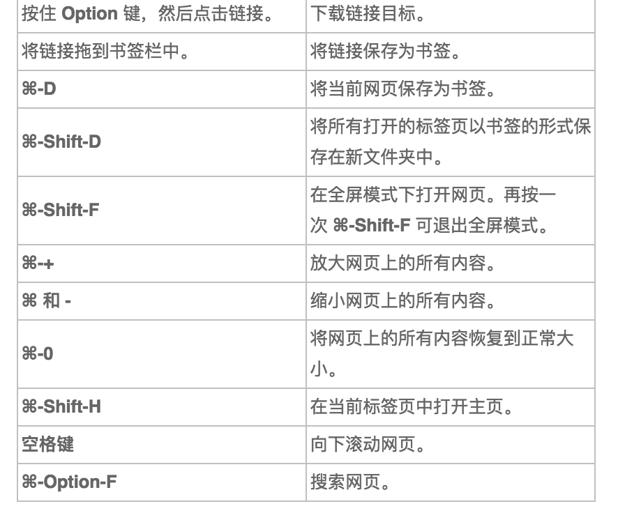

### 炫酷码生，从快捷键开始
##### 用mac有一段时间了，总感觉自己的用的一点儿也不炫（一直有颗装X的心（：），因为用谷歌浏览器比较多，就找了一些Mac上谷歌浏览器的一些常用的快捷键，当然这也不会炫到哪里去哈，哈哈哈。我记性不好，总忘，就想着记录下来了，也希望对你们有写帮助吧，呃。。。好记性不如烂笔头嘛，系不系

1.标签页和窗口快捷键

2.chrome 浏览器功能快捷键

3.网页快捷键

4.文本快捷键

*注意：以上摘自网络，如有侵权请请联系，立即删除！*
